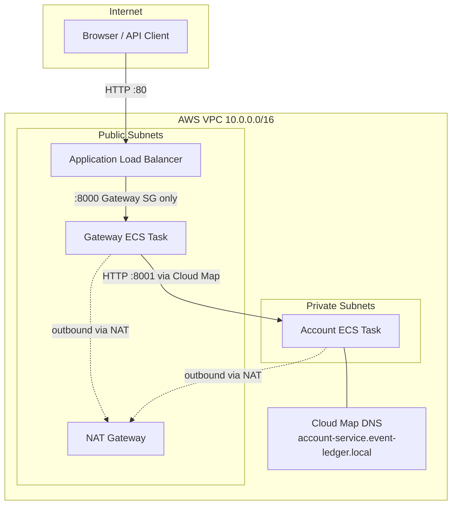
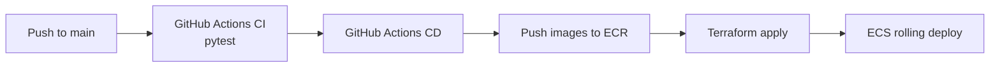

# Cloud Architecture

Event Ledger on AWS ECS Fargate — public Gateway, private Account Service.

## High-level topology

## Components

| Component | Technology | Exposure |
|---|---|---|
| **Event Gateway** | ECS Fargate, FastAPI | Public via ALB (port 80 → 8000) |
| **Account Service** | ECS Fargate, FastAPI | VPC-private only; no public IP |
| **Load balancer** | Application Load Balancer | Internet-facing |
| **Service discovery** | AWS Cloud Map (private DNS) | Internal: `account-service.event-ledger.local` |
| **Container registry** | Amazon ECR | Private; CI pushes images on deploy |
| **Persistence** | SQLite (per-task ephemeral) | PoC only — replace with RDS for production |
| **Observability** | CloudWatch Logs | Per-service log groups |

## Network security

### Security groups

| Group | Ingress | Egress |
|---|---|---|
| **ALB** | TCP 80 from `0.0.0.0/0` | All |
| **Gateway** | TCP 8000 from ALB SG only | All |
| **Account** | TCP 8001 from Gateway SG only | All |

Account Service cannot be reached from the internet or directly from the ALB. Only the Gateway security group may call it.

### Subnet placement

| Service | Subnet | Public IP |
|---|---|---|
| ALB | Public (2 AZs) | Yes (managed by ALB) |
| Gateway | Public (2 AZs) | Yes (for outbound + ALB routing) |
| Account | Private (2 AZs) | **No** |

Private subnets use a NAT Gateway for outbound traffic (ECR image pulls, AWS API calls).

## Request flow

1. Client sends `POST /events` to the ALB DNS name.
2. ALB forwards to a Gateway task on port 8000.
3. Gateway validates the payload, stores the event in its local SQLite DB, and calls Account Service at `http://account-service.event-ledger.local:8001`.
4. Cloud Map resolves the private DNS name to the Account task's ENI in the private subnet.
5. Account Service applies the transaction and returns; Gateway responds to the client.

Trace context propagates via W3C `traceparent` and `X-Trace-Id` headers across the Gateway → Account hop (visible in structured logs).

## CI/CD pipeline

See [CI/CD Guide](ci-cd.md) for workflow details and required GitHub secrets.

## Production hardening (not in PoC)

- **RDS** or Aurora instead of ephemeral SQLite
- **HTTPS** via ACM certificate on the ALB
- **AWS Secrets Manager** for configuration
- **X-Ray** or ADOT collector for distributed tracing in AWS
- **VPC endpoints** to reduce NAT Gateway cost
- **WAF** on the ALB for edge protection
- **Multi-AZ RDS** and ECS `desired_count > 1` for availability

## Terraform layout

Infrastructure is defined in [`infrastructure/aws/`](../infrastructure/aws/):

| File | Purpose |
|---|---|
| `main.tf` | VPC, subnets, NAT, ALB, ECS, Cloud Map, security groups |
| `ecr.tf` | ECR repositories for gateway and account images |
| `github_oidc.tf` | IAM role for GitHub Actions OIDC authentication |
| `backend.tf` | S3 remote state backend |
| `variables.tf` | Region, project name, image URIs |
